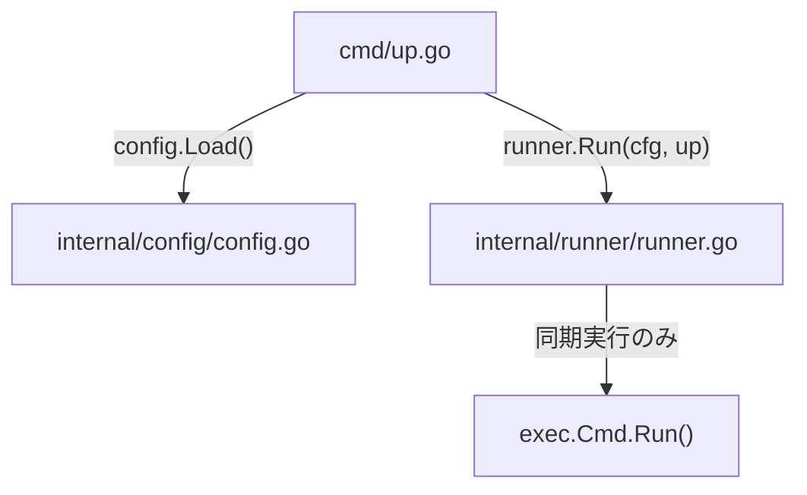
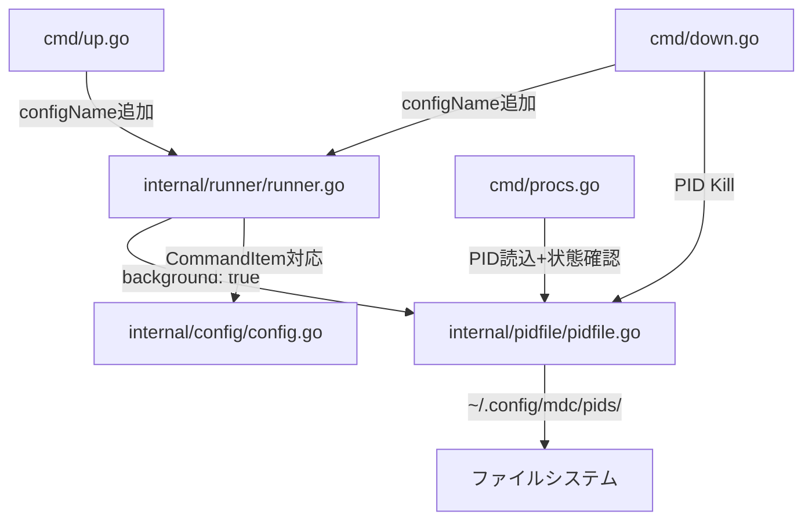

# Phase 1.5: バックグラウンドプロセス管理の実装

## 現状の構造

現在、`commands.up` / `commands.down` は `[]string` で、全コマンドは同期実行 (`cmd.Run()`) のみ対応。




## 変更後のアーキテクチャ




## 1. YAML構造の変更 ([internal/config/config.go](internal/config/config.go))

`Commands.Up` / `Commands.Down` を `[]string` から `[]CommandItem` に変更する。

```go
type CommandItem struct {
    Command    string `yaml:"command"`
    Background bool   `yaml:"background"`
}
```

- カスタム `UnmarshalYAML` を実装し、以下の両形式に対応:

```yaml
commands:
  up:
    - "make up"                        # 文字列 → CommandItem{Command: "make up", Background: false}
    - command: "npm run dev"           # 構造体 → CommandItem{Command: "npm run dev", Background: true}
      background: true
```

- `Commands` 構造体を更新:

```go
type Commands struct {
    Up   []CommandItem `yaml:"up"`
    Down []CommandItem `yaml:"down"`
}
```

- `CommandItem.CommandStr()` 等のヘルパーメソッドは不要（`Command` フィールドに直接アクセス）。

## 2. PID管理パッケージの新規作成 ([internal/pidfile/pidfile.go](internal/pidfile/pidfile.go))

新規パッケージ `internal/pidfile` を作成し、PIDファイルの永続化を担当する。

- 保存先: `~/.config/mdc/pids/<config-name>/<project-name>.json`
- ファイル形式（JSON配列、1プロジェクトに複数のバックグラウンドプロセスを許容）:

```json
[{"pid": 12345, "command": "npm run dev"}, {"pid": 12346, "command": "make watch"}]
```

- 主要関数:
  - `Save(configName, projectName string, entries []Entry) error` -- PIDファイルの書き込み
  - `Append(configName, projectName string, entry Entry) error` -- 既存ファイルにエントリ追加
  - `Load(configName, projectName string) ([]Entry, error)` -- 1プロジェクト分読み込み
  - `LoadAll(configName string) (map[string][]Entry, error)` -- config配下の全プロジェクト読み込み
  - `LoadAllConfigs() (map[string]map[string][]Entry, error)` -- 全config分読み込み（`mdc procs` 引数なし用）
  - `KillAll(configName string) error` -- 全PIDを `Kill` + ファイル削除
  - `IsRunning(pid int) bool` -- `os.FindProcess` + `Signal(syscall.Signal(0))` でプロセス生存確認
  - `Dir(configName string) (string, error)` -- PIDディレクトリパスを返す

## 3. Runner の更新 ([internal/runner/runner.go](internal/runner/runner.go))

- `Run` のシグネチャ変更: `Run(cfg *config.Config, action string, configName string) error`
- `commandsForAction` の戻り値を `[][]config.CommandItem` に変更
- `runSequential` / `runParallel` / `runProjectBuffered` を `CommandItem` 対応に更新
- バックグラウンド実行ロジック追加:
  - `background: true` の場合: `cmd.Start()` で起動、`pidfile.Append()` でPID保存、完了を待たない
  - `background: false` の場合: 従来通り `cmd.Run()` で同期実行

## 4. cmd/up.go, cmd/down.go の更新

- [cmd/up.go](cmd/up.go): `runner.Run(cfg, "up", configName)` に configName を渡す
- [cmd/down.go](cmd/down.go): `runner.Run(cfg, "down", configName)` の後に `pidfile.KillAll(configName)` を呼び出してバックグラウンドプロセスを終了

## 5. 新規サブコマンド `mdc procs` ([cmd/procs.go](cmd/procs.go))

- `cobra.MaximumNArgs(1)` で config-name を任意引数に
  - 引数あり: 指定configのプロセスのみ表示
  - 引数なし: 全configのプロセスを表示
- `text/tabwriter` を使ったテーブル出力:

```
CONFIG      PROJECT    COMMAND         PID     STATUS
myconfig    Frontend   npm run dev     12345   Running
myconfig    Backend    make watch      12346   Dead
```

- ステータス判定: `pidfile.IsRunning(pid)` を使用

## 6. テストの更新

- [internal/config/config_test.go](internal/config/config_test.go): `CommandItem` 形式のテスト追加（文字列形式 / 構造体形式 / 混在形式のYAMLパース）、既存テストの `[]string` → `[]CommandItem` 対応
- [internal/runner/runner_test.go](internal/runner/runner_test.go): `CommandItem` 対応 + バックグラウンド実行テスト + configName引数追加
- [internal/pidfile/pidfile_test.go](internal/pidfile/pidfile_test.go): 新規作成（Save/Load/Append/KillAll/IsRunning のテスト）
- [test/integration/integration_test.go](test/integration/integration_test.go): `CommandItem` 対応の更新

## 変更ファイル一覧


| 操作  | ファイル                                   |
| --- | -------------------------------------- |
| 変更  | `internal/config/config.go`            |
| 変更  | `internal/config/config_test.go`       |
| 変更  | `internal/runner/runner.go`            |
| 変更  | `internal/runner/runner_test.go`       |
| 変更  | `cmd/up.go`                            |
| 変更  | `cmd/down.go`                          |
| 新規  | `internal/pidfile/pidfile.go`          |
| 新規  | `internal/pidfile/pidfile_test.go`     |
| 新規  | `cmd/procs.go`                         |
| 変更  | `test/integration/integration_test.go` |


