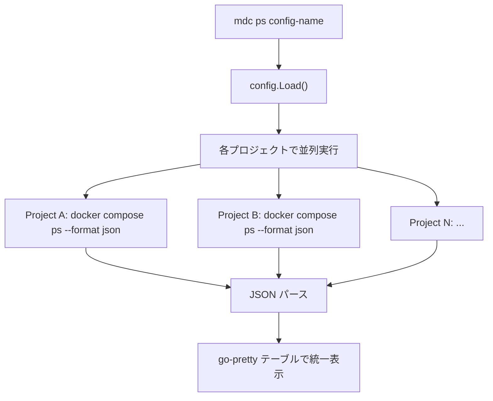

# `mdc ps` コマンドの実装

## 方針

各プロジェクトの `path` ディレクトリで `docker compose ps --format json` を実行し、JSON 出力をパースして go-pretty テーブルで統一表示する。Docker API (SDK) は使わず、既存の `os/exec` パターンを踏襲する。

## 実装対象ファイル

### 1. `internal/runner/ps.go` (新規作成)

`docker compose ps` の実行と JSON パースのロジックを担当する。

- `docker compose ps --format json` を各プロジェクトの path で実行
- JSON 出力をパース (NDJSON 形式: 1行1コンテナの JSON)
- 全プロジェクトを goroutine で並列実行し結果を集約 (config の `execution_mode` に関係なく ps は常に並列)
- `docker compose` が見つからない場合は `docker-compose` にフォールバック

主な型定義:

```go
type ContainerInfo struct {
    ID      string
    Name    string
    State   string
    Status  string
    Ports   string
}

type ProjectContainers struct {
    ProjectName string
    Containers  []ContainerInfo
    Err         error
}
```

### 2. `cmd/ps.go` (新規作成)

Cobra コマンドの定義。既存の [cmd/proc.go](cmd/proc.go) のテーブル出力パターンを踏襲する。

```go
var psCmd = &cobra.Command{
    Use:   "ps [config-name]",
    Short: "Show container status for all projects",
    Args:  cobra.ExactArgs(1),
    Run: func(cmd *cobra.Command, args []string) {
        // 1. config.Load(args[0]) で設定読み込み
        // 2. runner.CollectPS(cfg) で全プロジェクトのコンテナ情報を収集
        // 3. go-pretty テーブルで統一表示
    },
}
```

テーブルのカラム構成:

- PROJECT: YAML の project name
- CONTAINER ID: コンテナ ID (短縮12文字)
- NAME: コンテナ名
- STATUS: 実行状態 (running, exited 等)
- PORTS: ポートマッピング

### 3. `internal/runner/ps_test.go` (新規作成)

JSON パース部分のユニットテスト。

## 処理フロー




## 詳細設計

### docker compose ps --format json の出力形式

`docker compose ps --format json` は NDJSON (1行1オブジェクト) を返す:

```json
{"ID":"abc123","Name":"frontend-web-1","State":"running","Status":"Up 2 hours","Ports":"0.0.0.0:3000->3000/tcp"}
```

Go の struct にマッピングしてパースする。

### エラーハンドリング

- docker compose が未インストールの場合: エラーメッセージを表示して終了
- あるプロジェクトでコンテナが0件の場合: そのプロジェクトの行は出力しない
- あるプロジェクトで実行エラーの場合: そのプロジェクト名 + エラーメッセージをテーブル下に警告表示し、他のプロジェクトは正常表示する
- パスが存在しない場合: 警告表示して他のプロジェクトは続行

### STATUS の色分け (go-pretty/text)

- `running` -> 緑
- `exited` / その他 -> 赤

## 既存コードへの影響

- 他の既存ファイル: 変更なし (各コマンドは自身の `init()` で `rootCmd.AddCommand` するパターン)

